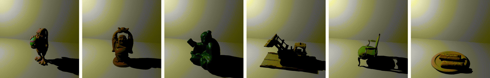

## S<sup>3</sup>-NeRF: Neural Reflectance Field from Shading and Shadow under a Single Viewpoint (NeurIPS 2022)

### [Project Page](https://ywq.github.io/s3nerf/) | [Paper](https://arxiv.org/abs/2210.08936) 

<p align="center">
    
</p>


This repository contains the implementation of the paper:

**S<sup>3</sup>-NeRF: Neural Reflectance Field from Shading and Shadow under a Single Viewpoint**  
[Wenqi Yang](https://ywq.github.io/),
[Guanying Chen](https://guanyingc.github.io/), 
[Chaofeng Chen](http://chaofengc.github.io/),
[Zhenfang Chen](https://zfchenunique.github.io/),
[Kwan-Yee K. Wong](http://i.cs.hku.hk/~kykwong/)  
Conference on Neural Information Processing Systems (NeurIPS), 2022

## Abstract
In this paper, we address the "dual problem" of multi-view scene reconstruction in which we utilize single-view images captured under different point lights to learn a neural scene representation. 
Different from existing single-view methods which can only recover a 2.5D scene representation (i.e., a normal / depth map for the visible surface), our method learns a neural reflectance field to represent the 3D geometry and BRDFs of a scene. 
Instead of relying on multi-view photo-consistency, our method exploits two information-rich monocular cues, namely shading and shadow, to infer scene geometry. 
Experiments on multiple challenging datasets show that our method is capable of recovering 3D geometry, including both visible and invisible parts, of a scene from single-view images. 
Thanks to the neural reflectance field representation, our method is robust to depth discontinuities. 
It supports applications like novel-view synthesis and relighting.  

<p align="center">
    
</p>

## Setup
Our work is implemented in PyTorch and tested with Ubuntu 18.04/20.04.
- Python 3.9
- PyTorch 1.8.0

Create an anaconda environment called `s3nerf` using
```
conda env create -f environment.yaml
conda activate s3nerf
```


## Download

Download the dataset and trained models using
```
sh download.sh
```
If the above command is not working, please manually download the files:
- Trained models of our method from OneDrive ([data.tgz](https://connecthkuhk-my.sharepoint.com/:f:/g/personal/wenqi_connect_hku_hk/Eh0ROALu20BGu2g3rtwCIUYBvP7lboX18OYGmVd0gOCrZw?e=3mteEV)) and put the extracted folder `data/` under the project path;
- Preprocessed dataset of both synthetic and real objects from OneDrive ([dataset.tgz](https://connecthkuhk-my.sharepoint.com/:f:/g/personal/wenqi_connect_hku_hk/Eh0ROALu20BGu2g3rtwCIUYBvP7lboX18OYGmVd0gOCrZw?e=3mteEV)) and put the extracted folder `dataset/` under the project path;
- Environment maps for relighting application from OneDrive ([envmap.tgz](https://connecthkuhk-my.sharepoint.com/:f:/g/personal/wenqi_connect_hku_hk/Eh0ROALu20BGu2g3rtwCIUYBvP7lboX18OYGmVd0gOCrZw?e=3mteEV)) and put the extracted folder `envmap/` under the project path;
- Released models of SDPS-Net from Google Drive ([LCNet and NENet](https://drive.google.com/drive/folders/1HCW9YDfsFoPxda3GDTjj3L5yuQUXw8a3?usp=sharing)) and put them in `preprocessing/data/models/` (for real data preprocessing).

Our results on [LUCES](https://www.toshiba.eu/pages/eu/Cambridge-Research-Laboratory/download-luces-dataset) dataset can be found at [`luces.tgz`](https://connecthkuhk-my.sharepoint.com/:f:/g/personal/wenqi_connect_hku_hk/Eh0ROALu20BGu2g3rtwCIUYBvP7lboX18OYGmVd0gOCrZw).


### Dataset

The dataset contains 9 synthetic scenes (where `ARMADILLO`, `BUDDHA`, `BUNNY`, `BUNNY_COLOR`, `MIX`, `READING` are rendered using [Mitsuba](https://www.mitsuba-renderer.org/) and `CHAIR`, `HOTDOG`, `LEGO` are rendered using [Blender](https://www.blender.org/))  and 3 real captured scenes (`BOTANIST`, `CAT`, `GIRL`).

After downloaded and extracted, you can find all the processed datasets in `./dataset` folder.

### Model
We release the pretrained models of 9 synthetic scenes and 3 real captured scenes. After downloaded and extracted, you can find them in `./data` folder.


##  Test & Evaluation
After downloading the pretrained models, you may run the following code to test and evalauate the results.
```bash
## Please replace the `GPU_ID` and `OBJ_NAME` with your choices.
python eval.py --gpu GPU_ID --obj_name OBJ_NAME --expname test_1 --exp_folder data

python evaluation.py --obj OBJ_NAME --expname test_1 --test_out_dir test_out
```
For testing and evaluating on your own trained models:
```bash
## Please replace the `GPU_ID`, `OBJ_NAME` and `EXPNAME` with your choices.
python eval.py --gpu GPU_ID --obj_name OBJ_NAME --expname EXPNAME
## other optional arguments
# --exp_folder EXP_FOLDER        # specify exp_folder (default: ./out)
# --test_out_dir TEST_OUT_DIR     # test_out_dir (default: ./test_out)
# --save_npy                      # save npy files
# --load_iter N_ITER              # load from specific iteration
# --chunk N_CHUNK                 # modify according to your GPU memory (default: 1024)

## Please replace the `OBJ_NAME`, `EXPNAME` and `TEST_OUT_DIR` with your choices.
python evaluation.py --obj OBJ_NAME --expname EXPNAME --test_out_dir TEST_OUT_DIR
```


##  Train
To train a model from scratch, please run
```bash
##  replace `GPU_ID`, `OBJ_NAME`  with your choices.
python train.py configs/OBJ_NAME.yaml --gpu GPU_ID
```

For real captured data (without calibarted lights), please first go to [preprocessing](./preprocessing) and obtain the estimated light direcitons with pretrained [SDPS-Net](https://github.com/guanyingc/SDPS-Net), then roughly measure the camera-object distance and light-object distance (specify the `dcam`, `dlight` in config files) for camera/light position initialization. 

## Relighting and Material Editing
Our method jointly recover the geometry and BRDFs of a scene by exploiting monocular shading and shadow cues.
After optimization, the reconstructed scenes can be used for novel-view rendering, relighting, and material editing. You may render under environmental lighting and edit materials with the trained models for applications.

- For rendering with environment lighting
```bash
## replace `OBJ_NAME`, `GPU_ID` and 'EXPNAME` with your choices. 
## You may specify the envmap ID (there are some demo envmaps provided under "envmap" folder, please make sure you have downloaded and extracted the envmaps).
python eval.py --gpu GPU_ID --obj_name OBJ_NAME --expname EXPNAME --type env 
## arguments
# --envmap_id ENVMAP_ID       # specify the envmap ID (default: 3)
# --envmap_path ENVMAP_PATH   # specify the path of envmaps (default: ./envmap)
```

- For material editing
```bash
## replace `OBJ_NAME`, `GPU_ID` and 'EXPNAME` with your choices. 
## For albedo editing, enable `--edit_albedo`; for specular editing, enable `--edit_specular`.
python eval.py --gpu GPU_ID --obj_name OBJ_NAME --expname EXPNAME 
## arguments
# --edit_albedo       # enable albedo editing
# --color COLOR       # specify the new color using <Hex Color Code>, e.g., "#E24A0F". if not specified, a random color will be used.
# --edit_specular     # enable specular editing
# --basis BASIS       # specify the new basis ID, e.g., "3". if not specified, a random basis will be used.
```

```bash
## other optional arguments
# --exp_folder EXP_FOLDER        # specify exp_folder (default: ./out)
# --test_out_dir TEST_OUT_DIR     # test_out_dir (default: ./test_out)
# --save_npy                      # save npy files
# --load_iter N_ITER              # load from specific iteration
# --chunk N_CHUNK                 # modify according to your GPU memory (default: 1024)
```

## Mesh Extraction
Before extracting the mesh, please first compile the extension modules by
```bash
python setup.py build_ext --inplace
```
For quickly extracting a mesh from a trained model, run
```bash
##  replace `GPU_ID`, `OBJ_NAME`, `EXPNAME` with your choices.
python extract_mesh.py --gpu GPU_ID --obj_name OBJ_NAME --expname EXP_NAME
## other optional arguments
# --exp_folder EXP_FOLDER         # specify exp_folder (default: ./out)
# --test_out_dir TEST_OUT_DIR     # specify test_out_dir (default: ./test_out)
# --load_iter N_ITER              # load from specific iteration
# --mesh_extension EXTENSION      # choose mesh extension (obj or ply, default: obj)
# --desk LOC_DESK                 # regions above the desk plane are valid in the mesh (default: -1.2)
# --wall LOC_WALL                 # regions in front of the wall plane are valid in the mesh (default: -2.2)
```

## Prepare Your Own Data
We provide preprocessed datasets, if you want to try with your own data, please prepare your dataset and parameters as follows.

### Synthetic Data
- Data Structure
    ```
    └── OBJ_NAME
       ├── params.json
       ├── rgb
       │   ├── 001.png
       │   └── ...
       ├── visibility 
       │   ├── 001.png
       │   └── ...
       ├── depth.npy
       ├── mask_obj.png
       ├── normal.npy
       └── normal.png
    ```

- Parameters in `params.json` 
    ```
    == PARAM ==             == HELP ==
    obj_name                name of the object
    imhw                    resolution of images as [H,W]      
    K                       K matrix 
    pose_c2w                camera-to-world transformation matrix of training view    
    light_pos               light positions for training (L*3) 
    light_pos_test          light positions for testing (L*3) 
    ```

### Real Captured Data
For real captured data, please specify `capture: True` in config file and follow the other config options of the 3 real scenes (`BOTANIST`, `CAT`, `GIRL`).
- Data Structure
    ```
    └── OBJ_NAME
       ├── params.json
       ├── rgb
       │   ├── 001.png
       │   └── ...
       └── mask_obj.png
    ```

- Parameters in `params.json` 
    ```
    == PARAM ==             == HELP ==
    obj_name                name of the object
    imhw                    resolution of images as [H,W]      
    K                       K matrix
    ```


## Citation
If you find this code or the provided models useful in your research, please consider cite: 
```bibtex
@inproceedings{yang2022s3nerf,
    title={S$^3$-NeRF: Neural Reflectance Field from Shading and Shadow under a Single Viewpoint},
    author={Yang, Wenqi and Chen, Guanying and Chen, Chaofeng and 
            Chen, Zhenfang and Wong, Kwan-Yee K.},
    booktitle={Conference on Neural Information Processing Systems (NeurIPS)},
    year={2022}
}
```


## Acknowledgement
Part of our code is based on the awesome [UNISURF](https://github.com/autonomousvision/unisurf).
